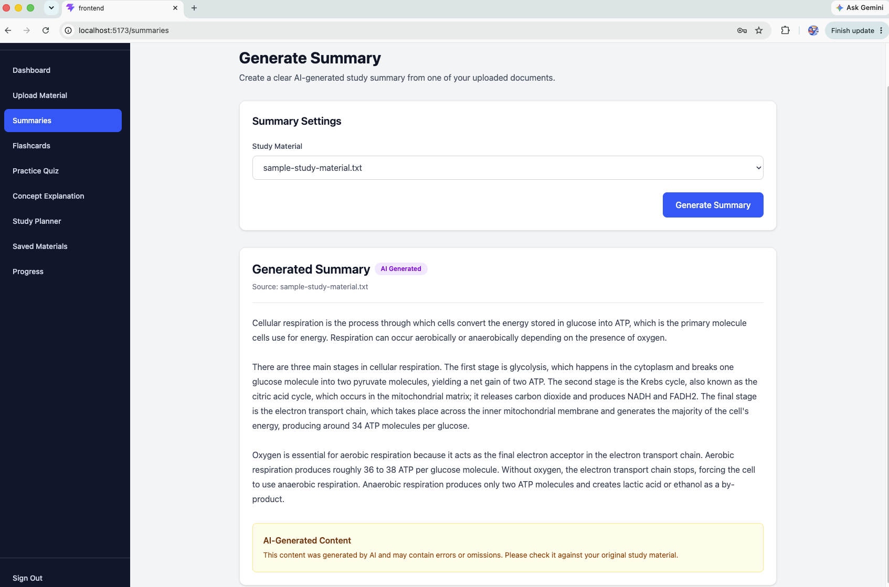
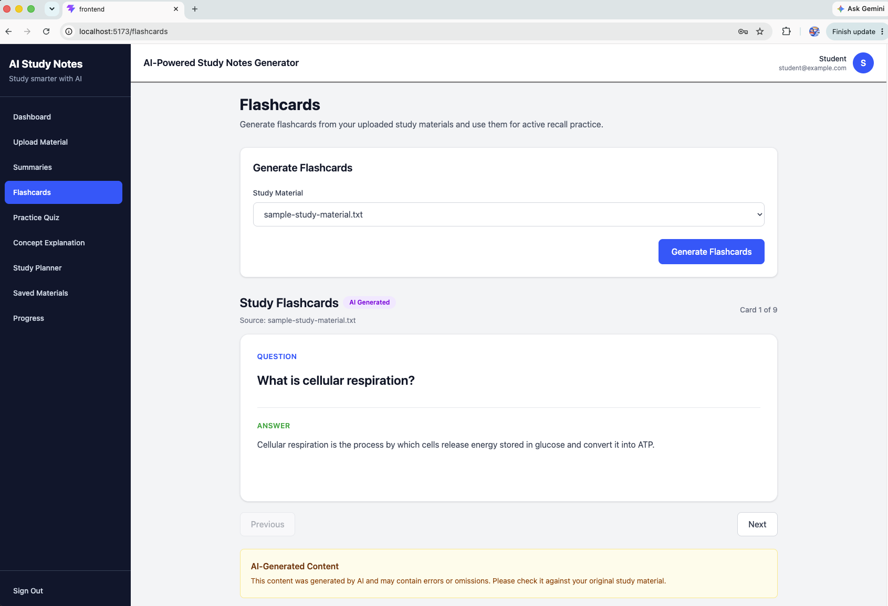
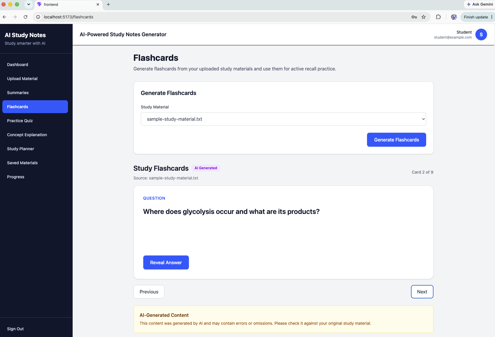
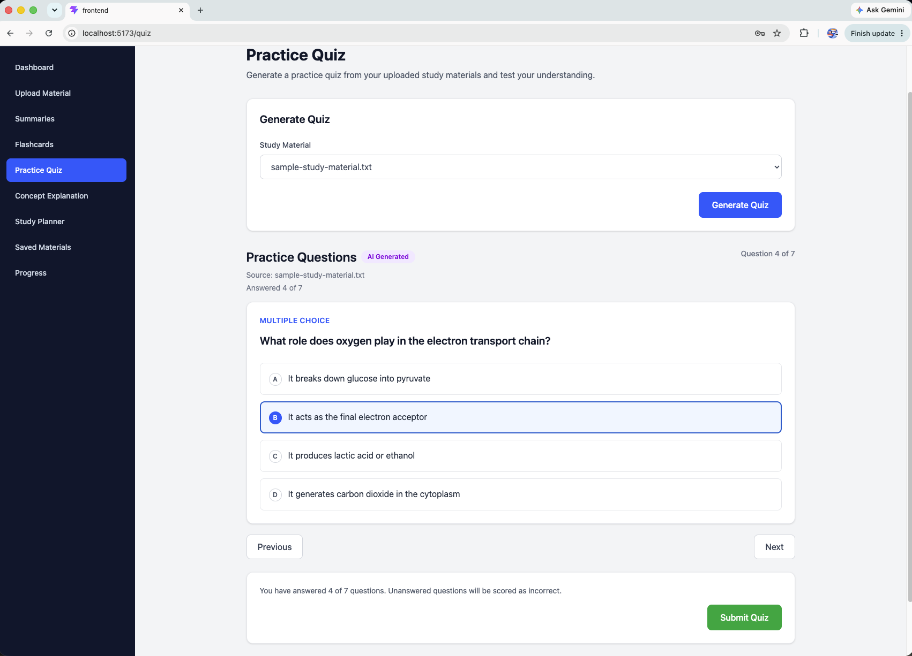
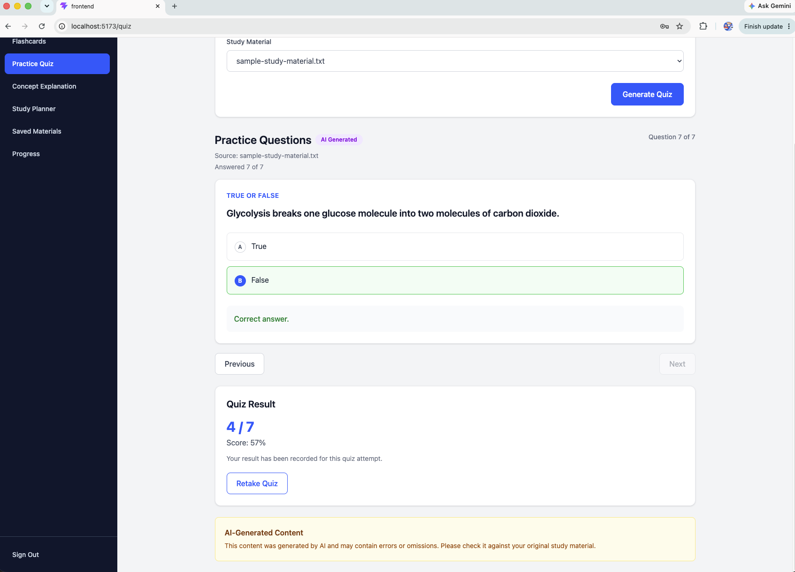
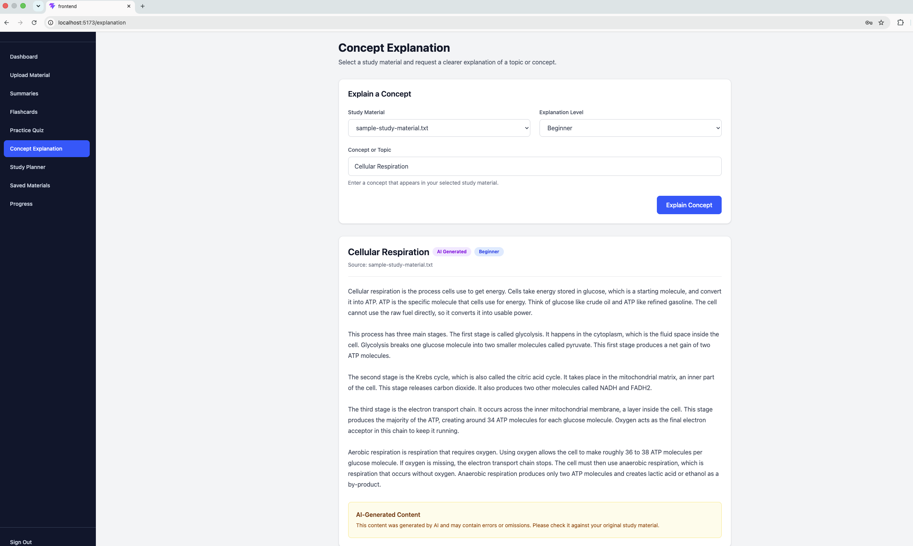
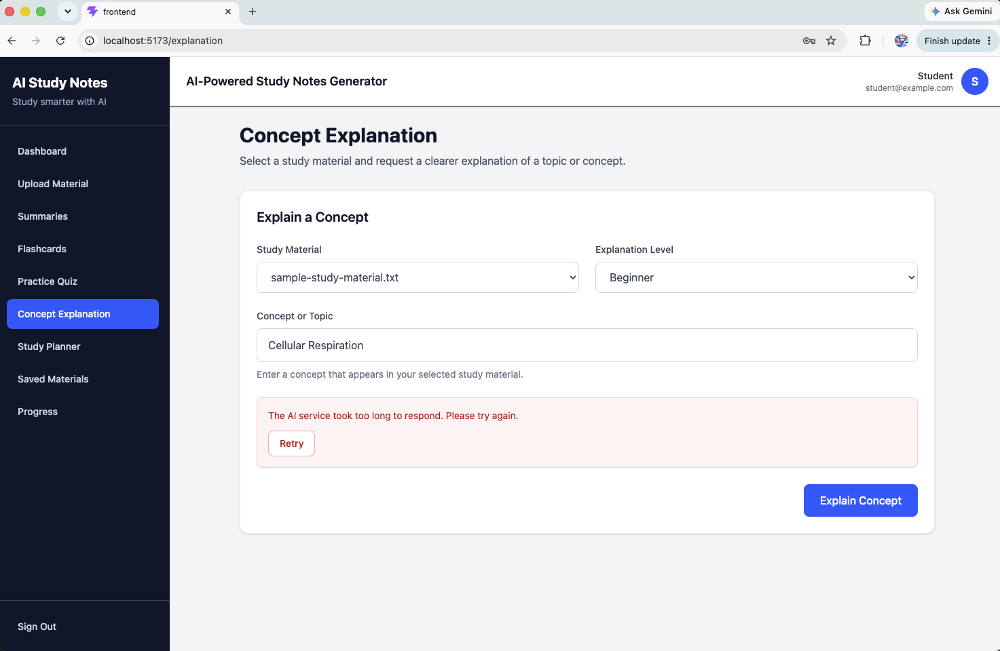

# Manual verification — FR16 labelling and the live timeout path

**Owner:** Member 3 (Natthapong Rinsakul) · GitHub issue **#119**
**Date performed:** 21 September 2026
**Environment:** Local — React frontend on `localhost:5173`, Node/Express backend on
`localhost:5000`, MySQL, and the **real Google Gemini API** (not a stub)
**Input document:** `testing/fixtures/sample-study-material.txt` (155 words, 988 characters,
"Cellular Respiration")

---

## Why this folder exists

The automated suite proves what the **API** returns. It cannot prove what a student
**sees on screen**, and it deliberately stubs the model so it consumes no Gemini quota.
Two checklist items therefore require a person to look at the running application:

| Issue #119 item | Why it is manual |
|---|---|
| *Recheck responsible-AI labels/disclaimers in returned data* | `PRIV-04` proves the API returns `is_ai_generated` and the disclaimer text. That they are **visibly displayed** is the interface half of the FR16 quality metric. |
| *Recheck Gemini timeout handling* | `ERR-01` proves the timeout path against a stubbed model. Observing it fire against the **real** Gemini service cannot be scheduled — it depends on upstream response time. |

These screenshots close both. The automated evidence is in
[`../reports/final-verification-report.html`](../reports/final-verification-report.html).

---

## The requirement being verified

**FR16.1** — *Every generated summary, flashcard set, quiz and explanation shall carry a
visible "AI-generated" label with a short disclaimer.*

**Quality metric** — *100% of AI-generated content shown in the interface must carry the
AI-generated label and disclaimer, verified by inspection across all four content types.*

In the interface these appear as:

- a purple **`AI Generated`** badge beside the content heading, and
- a yellow **`AI-Generated Content`** panel reading *"This content was generated by AI and
  may contain errors or omissions. Please check it against your original study material."*

---

## 1. Summary — FR16-01

**Verifies:** FR16.1 for the Summary content type.
**Supports:** *Recheck Summary generation* · *Recheck responsible-AI labels/disclaimers in
returned data*.

**What to look for:** the `AI Generated` badge beside **Generated Summary**; the source line
*"Source: sample-study-material.txt"*; and the yellow **AI-Generated Content** disclaimer panel
at the foot of the generated prose.

---

## 2. Flashcards — FR16-02 and FR16-03

**Verifies:** FR16.1 for the Flashcards content type.
**Supports:** *Recheck Flashcard generation* · *Recheck responsible-AI labels/disclaimers*.

**What to look for:** the `AI Generated` badge beside **Study Flashcards**; the card counter
(*Card 1 of 9*, *Card 2 of 9*) confirming nine cards were generated from the document; and the
disclaimer panel present in **both** views.

Two screenshots are included because the flashcard interface has two states. FR16-02 shows a
card with its answer revealed; FR16-03 shows the next card with the answer still hidden behind
**Reveal Answer**. The label and disclaimer persist across both, which is the point being
evidenced — the labelling is not attached to one view only.

---

## 3. Practice Quiz — FR16-04 and FR16-05

**Verifies:** FR16.1 for the Practice Quiz content type, and quiz marking end to end.
**Supports:** *Recheck Practice Quiz generation* · *Recheck quiz scoring tests* ·
*Recheck responsible-AI labels/disclaimers*.

**What to look for in FR16-04:** the `AI Generated` badge beside **Practice Questions**;
*Question 4 of 7*; a multiple-choice question with option B selected; and the footer
*"You have answered 4 of 7 questions. Unanswered questions will be scored as incorrect."*

**What to look for in FR16-05:** the `AI Generated` badge; *Question 7 of 7*; a true/false
question marked **Correct answer**; the **Quiz Result** panel showing **4 / 7 — Score: 57%**
with *"Your result has been recorded for this quiz attempt."*; and the **AI-Generated Content**
disclaimer panel beneath it.

> **Note on FR16-04.** The disclaimer panel is **not visible** in this screenshot — the page is
> scrolled to the question being answered, and the panel sits below the visible area. The
> disclaimer for the Quiz content type is evidenced by **FR16-05**, where both the badge and the
> panel appear together. FR16-04 is included for the answering interface and the partial-answer
> warning, not as disclaimer evidence.

The *Quiz Result 4 / 7* panel also corroborates `QA-02`, which asserts server-side marking
against a known answer key.

---

## 4. Concept Explanation — FR16-06

**Verifies:** FR16.1 for the Concept Explanation content type, and FR12.1 level selection.
**Supports:** *Recheck Concept Explanation generation* · *Recheck responsible-AI
labels/disclaimers*.

**What to look for:** **two** badges beside the heading *Cellular Respiration* — `AI Generated`
and `Beginner`; the requested concept echoed as the heading; the source line; the explanation
written in plain language appropriate to the beginner level (*"Think of glucose like crude oil
and ATP like refined gasoline"*); and the disclaimer panel at the foot.

The `Beginner` badge is evidence for **FR12.1**, which requires the selected explanation level
to be applied rather than merely accepted as input.

---

## 5. Live timeout and successful retry — ERR-01

**Verifies:** `AI_TIMEOUT` handling and NFR5 document retention, against the **real** Gemini
service.
**Supports:** *Recheck Gemini timeout handling* · *Verify AI failures do not corrupt or remove
uploaded documents*.

**What to look for:** the error panel reading *"The AI service took too long to respond. Please
try again."*; the **Retry** button offered beside it; and — importantly — that the form above is
**unchanged**: the study material is still selected, the level is still *Beginner*, and the
concept *Cellular Respiration* is still entered.

### What happened

1. A Concept Explanation was requested for *Cellular Respiration* at beginner level.
2. Gemini did not respond within the 60-second limit configured in `ai.service.js`.
3. The backend abandoned the request, classified it as `AI_TIMEOUT` and returned **504** with
   `retryable: true`.
4. The interface displayed the message above and offered **Retry**. **The uploaded document was
   retained** — nothing had to be uploaded again.
5. **Retry succeeded**, generating in roughly 20 seconds. The result is the screenshot in
   section 4 above (`FR16-06-explanation.png`), captured two minutes after this error.

### Why this matters

This is the **first time the timeout path has fired in real use**. Until 13 September it had
never executed at all — it was the last entry in the *"not yet verified"* section of
`testing/test-log-document-processing-ai.md`, recorded as blocked because a slow response
cannot be requested on demand.

`ERR-01` in the automated suite proves this path against a stubbed model. This screenshot
proves it against the real service, under conditions nobody arranged. Together they satisfy
**NFR5**: a failure is reported in terms the student can act on, and no work is lost.

The timeout is **not a defect**. The six recorded measurements for test case T-24 range from
**20.2 to 43.0 seconds**, with a standard deviation of 7.8 seconds — so the slowest measured run
already sat within about 17 seconds of the 60-second limit. Generation time is almost entirely
Gemini's response time; upload and text extraction complete in about 0.1 seconds. An occasional
run crossing 60 seconds is therefore expected behaviour from a shared free-tier service rather
than a fault, and the system handled it as designed.

Times observed during this manual session were consistent with that spread and varied by content
type, the Practice Quiz being the quickest and the Summary the slowest — which matches how much
text each one asks the model to produce.

---

## Checklist items closed by this folder

| Issue #119 item | Evidence |
|---|---|
| Recheck Summary generation | FR16-01 |
| Recheck Flashcard generation | FR16-02, FR16-03 |
| Recheck Practice Quiz generation | FR16-04, FR16-05 |
| Recheck Concept Explanation generation | FR16-06 |
| Recheck responsible-AI labels/disclaimers in returned data | FR16-01, FR16-02, FR16-03, FR16-05, FR16-06 |
| Recheck Gemini timeout handling | ERR-01 (live) + `ERR-01` (automated) |
| Verify AI failures do not corrupt or remove uploaded documents | ERR-01 + retry in FR16-06 |
| Recheck quiz scoring tests | FR16-05 (4/7 recorded) + `QA-02` |

This closes the **fifth and last** of the five quality standards for these subsystems. The other
four — extraction accuracy, performance against NFR1, AI output accuracy against risk R1, and
consent enforcement — were recorded on 12 and 13 September and are listed in
[`../reports/final-verification-report.html`](../reports/final-verification-report.html).

---

## Notes on the screenshots

- All images are of the local development environment. The account shown,
  `student@example.com`, is a test account created for this verification; it is not a real
  person's data.
- No API key, password, token or other credential is visible in any image. This was checked
  image by image.
- Automated equivalents of these checks, where they exist, are in `testing/evidence/`, named by
  Test ID.
